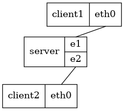

Qeneth
======

String together QEMU VMs with UDP sockets using [graphviz(7)][],
[mustache(1)][] and duct tape.

```
               .--------.
    Graph ---> |        |      .---------------------.
               | qeneth | ---> | qemu-system-${ARCH} |-.
Templates ---> |        |      '---------------------' |-.
               '--------'        `---------------------' |
                                   `---------------------'
```

`qeneth` starts from an undirected graphviz(7) **Graph** of "record
nodes". The graph is analyzed, annotated with information, and split
into per-node YAML documents. Finally, these documents are filtered
through one or more mustache(1) **Templates** to create executable
scripts. Typically the generated script will launch an instance of
`qemu-system-${ARCH}`, but it could be anything.

Some basic process monitoring is available, but the executables can
also be run manually or through some other process monitor.


Installation
------------

Clone the repository and place the absolute path to `qeneth` is in your
`$PATH`.  A few tools are required to run, on Debian based systems like
Ubuntu or Linux Mint:

```sh
~$ sudo apt install e2fsprogs graphviz ruby-mustache squashfs-tools \
        qemu-system-x86 qemu-utils
```

> Basic completion support for Bash is available. Copy or symlink
> `qeneth-complete.sh` to `/etc/bash_completion.d` to enable it.


Tutorial
--------

This tutorial makes use of one of the bundled [Infix][] NOS templates.
We start by creating our tutorial directory where all files related to
our network project will be stored.  Then we download a pre-built Infix
image into it:

```sh
~$ mkdir tutorial
~$ cd tutorial/
~/tutorial$ wget -q https://github.com/kernelkit/infix/releases/download/latest/infix-x86_64.tar.gz
~/tutorial$ tar xf infix-x86_64.tar.gz infix-x86_64/infix-x86_64.img
~/tutorial$ mv infix-x86_64/infix-x86_64.img .
~/tutorial$ rm -rf infix-x86_64/ infix-x86_64.tar.gz
```

Next, let's setup our topology, edit `~/tutorial/topology.dot.in`:

```.dot
graph "tutorial" {
    node [shape=record];
    qn_template="infix-x86_64";
    qn_append="quiet";
    qn_mem="512M";
    qn_oui="00:a0:85";

    server [label="server   | { <e1> e1 | <e2> e2 }", qn_basemac="00:07:7c:00:00:00"];
    client1 [label="client1 | { <eth1> eth1 }"];
    client2 [label="client2 | { <eth1> eth1 }"];

    server:eth0 -- client1:eth0 [qn_tailmac="00:07:7c:12:34:56", qn_headmac="08:00:20:c0:ff:ee"];
    server:eth1 -- client2:eth0;
}
```

The two clients in this example connect to the server, which has two
interfaces named `e1` and `e2`.  We name all `<interfaces>` (called
"ports" in graphviz) and put the same label on them.  The name is used
in all qemu script generation and the label is "only" used when
generating a graph.  Use your favorite graphviz(7) layout engine to
visualize it.  Here we've used `neato -Tpng topology.dot.in
-otopology.png`:



 - `qn-append` is what is appended to the kernel command line
 - `qn_mem` overrides the template's default RAM size for all nodes
 - `qn_oui` sets a default MAC OUI prefix for all nodes
 - `qn_basemac` changes the base MAC used for all connections on one node
 - `qn_tailmac` and `qn_headmac` overrides the MAC address for a specific interface on a link

> **Note:** the names `headmac` and `tailmac` refer to the head and tail
> end of the edge in the graph.  Even though we do not use directed
> edges the left side is called the tail and the right is head.

Everything we need is now in place - so we can generate the scripts and
all support files:

```sh
~/tutorial$ qeneth generate
Info: Generating topology
Info: Generating node YAML
Info: Generating executables
~/tutorial$ ls
client1         client2         infix-x86_64.img  server.yaml   topology.dot.in
client1.mactab  client2.mactab  server            topology.dot
client1.yaml    client2.yaml    server.mactab
```

Finally, we can start our network:

```sh
~/tutorial$ qeneth start
Info: Launching server
Info: Launching client1
Info: Launching client2
~/tutorial$ qeneth status
NODE           PID  CNSOL  MONTR
server     2811526  10000  10001
client1    2811527  10010  10011
client2    2811528  10020  10021
```

Attach to the different nodes with `qeneth console NODE`.  Use Ctrl-] to
get to the `telnet>` prompt, quit with 'q' followed by enter:

```sh
~/tutorial$ qeneth console server
Trying 127.0.0.1...
Connected to localhost.

Infix by KernelKit (console)
server login: root
Note: use help, show, and setup commands to set up and diagnose the system.
root@server:~# ip -br link
lo               UNKNOWN        00:00:00:00:00:00 <LOOPBACK,UP,LOWER_UP>
eth0             UP             02:00:00:00:02:00 <BROADCAST,MULTICAST,UP,LOWER_UP>
eth1             UP             02:00:00:00:02:01 <BROADCAST,MULTICAST,UP,LOWER_UP>
root@server:~#
telnet> Connection closed.
~/tutorial$
```

When we are done, we stop all the nodes:

```sh
~/tutorial$ qeneth stop
Info: Stopping server
Info: Stopping client1
Info: Stopping client2
```


### Host Interaction

In addition to VM-to-VM communication, a Qeneth network can also be
connected to the host system. This is done by connecting a VM port to
a port on a node named `host`. Every port on `host` will show up as a
TAP interface.

Let's look at an example topology (`~/host-net/topology.dot.in`):

```.dot
graph "host-net" {
        node [shape=record];
        qn_template="infix-x86_64-classic";

        host   [label="host  | { <tap-infix> tap-infix }"];
        infix  [label="infix | { <eth0> eth0 | <eth1> eth1 }"];

        host:"tap-infix" -- infix:eth0;
}
```

After generating and starting the network, a new TAP interface
(`tap-infix`) is created, which is connected to `eth0` inside the VM
`infix`:

```sh
~/host-net$ qeneth generate && qeneth start
Info: Generating topology
Info: Generating node YAML
gvpr: warning: Using value of uninitialized edge attribute "qn_headport" of "host--infix"
Info: Generating executables
Info: Launching infix
~/host-net$ ip -br link | grep tap-infix
tap-infix        DOWN           ce:fe:82:f8:cd:19 <BROADCAST,MULTICAST>
~/host-net$ ip addr add 10.10.10.1/24 dev tap-infix
~/host-net$ qeneth console infix
Trying 127.0.0.1...
Connected to localhost.

Infix by KernelKit (console)
infix login: root
Note: use help, show, and setup commands to set up and diagnose the system.
root@infix:~# ip addr add 10.10.10.2/24 dev eth0
root@infix:~# ping -c 3 10.10.10.1
PING 10.10.10.1 (10.10.10.1): 56 data bytes
64 bytes from 10.10.10.1: seq=0 ttl=64 time=0.241 ms
64 bytes from 10.10.10.1: seq=1 ttl=64 time=0.474 ms
64 bytes from 10.10.10.1: seq=2 ttl=64 time=0.504 ms

--- 10.10.10.1 ping statistics ---
3 packets transmitted, 3 packets received, 0% packet loss
round-trip min/avg/max = 0.241/0.406/0.504 ms
root@infix:~#
telnet> q
Connection closed.
```

[Infix]: https://github.com/kernelkit/infix
[graphviz(7)]: https://graphviz.org/
[mustache(1)]: https://mustache.github.io/
